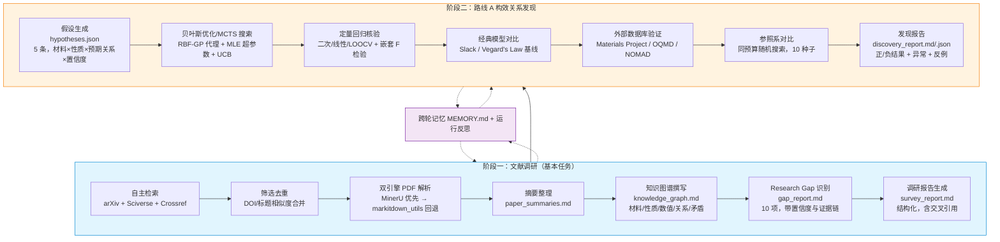
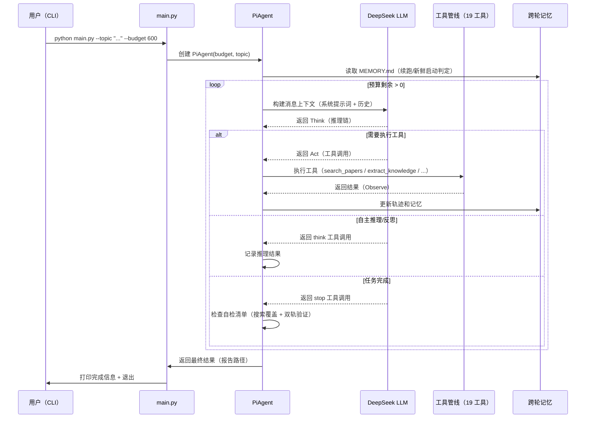
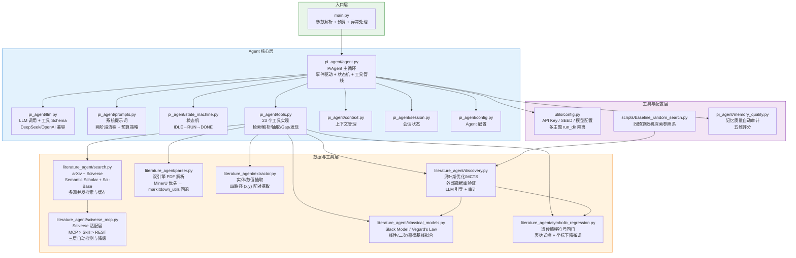
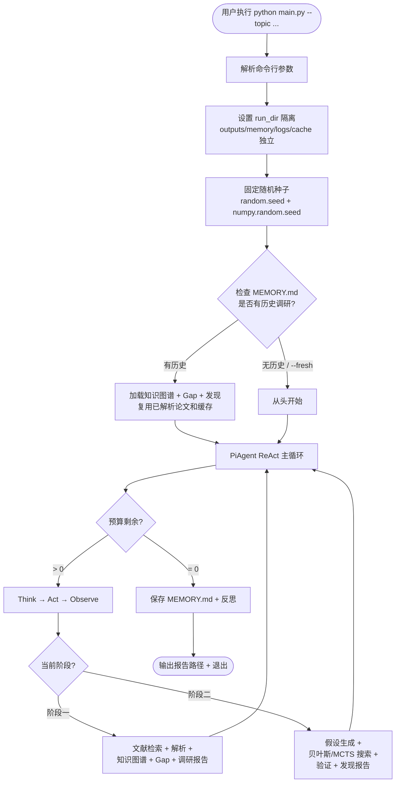

# Pi-Agent 系统架构文档

> **项目名称**：Pi-Agent —— 材料科学文献驱动的构效关系自主发现智能体
> **版本**：v2.0（初赛终版）

---

## 1. 项目总体架构

---

## 2. Agent 主循环（ReAct 循环：Think → Act → Observe）

---

## 3. 数据流图

```mermaid
flowchart LR
    subgraph Input["数据输入"]
        D1[arXiv API] --> Search
        D2[Sciverse API<br/>MCP/Skill/REST 三层接入] --> Search
        D3[Crossref] --> Search
    end

    subgraph Processing["处理管道"]
        Search["文献检索<br/>search.py<br/>多源并发 + 去重合并"] --> Parse
        Parse["文档解析<br/>parser.py<br/>MinerU + markitdown_utils<br/>PDF/DOCX/HTML → Markdown"] --> Extract
        Extract["知识抽取<br/>extractor.py<br/>entity/value extraction<br/>+ (x,y) pair extraction"] --> KG
    end

    subgraph Knowledge["知识组织"]
        KG["知识图谱<br/>knowledge_graph.md<br/>R1-R33 构效关系<br/>量化建模数值表"] --> Gap
        Gap["Gap 识别<br/>gap_report.md<br/>10 项 Gap<br/>严重程度 × 置信度 × 证据链"]
    end

    subgraph Discovery["构效关系发现"]
        Gap --> Hypo["假设生成<br/>hypotheses.json<br/>5 条可验证假设"]
        Hypo --> Search2["贝叶斯/MCTS 搜索<br/>discovery.py<br/>RBF-GP + UCB + LLM 引导"]
        Search2 --> Validate["定量验证<br/>quantitative_validation.md<br/>Classical Models 对比<br/>Slack / Vegard / Linear"]
        Validate --> External["外部数据库验证<br/>Materials Project / OQMD"]
        External --> Report
    end

    subgraph Output["输出产物"]
        Report["发现报告<br/>discovery_report.md/.json<br/>正/负/异常/反例四类信号"]
    end

    KG --> Summary["调研报告<br/>survey_report.md"]
    Gap --> Summary

    style Input fill:#e8f5e9,stroke:#388e3c
    style Processing fill:#e3f2fd,stroke:#1976d2
    style Knowledge fill:#fff8e1,stroke:#ffa000
    style Discovery fill:#fce4ec,stroke:#c62828
    style Output fill:#f3e5f5,stroke:#7b1fa2
```

---

## 4. 组件依赖关系图

---

## 5. 各组件简要说明

### 5.1 入口层

| 组件 | 文件 | 说明 |
|------|------|------|
| **主入口** | `main.py` | 命令行参数解析（`--topic` / `--budget` / `--run-dir` / `--fresh` / `--seed`），预算控制，异常处理，启动 PiAgent |

### 5.2 Agent 核心层

| 组件 | 文件 | 说明 |
|------|------|------|
| **PiAgent** | `pi_agent/agent.py` | Agent 主循环，事件驱动架构 + 状态机 + 工具管线调度。负责 ReAct 循环（Think -> Act -> Observe），跨轮记忆管理 |
| **LLM 调用** | `pi_agent/llm.py` | DeepSeek V4 Flash API 调用封装（OpenAI 兼容接口），工具 Schema 定义，支持任意兼容端点替换 |
| **系统提示词** | `pi_agent/prompts.py` | 两阶段流程提示词（文献调研 + 构效关系发现），预算策略（阶段一 <= 35%，阶段二 >= 55%），23 个工具用法说明，ReAct 协议规则 |
| **状态机** | `pi_agent/state_machine.py` | Agent 状态机：IDLE -> RUN -> DONE，处理中断/恢复/错误状态转换 |
| **工具实现** | `pi_agent/tools.py` | 23 个工具实现：`think` / `search_papers` / `parse_paper` / `extract_knowledge` / `analyze_gaps` / `generate_report` / `generate_hypotheses` / `run_discovery_search` / `check_novelty` / `validate_discovery` / `run_model_comparison` / `symbolic_regression` / `cross_theme_connections` / `generate_discovery_report` 等 |
| **上下文管理** | `pi_agent/context.py` | 会话上下文管理，token 预算跟踪，压缩策略 |
| **会话状态** | `pi_agent/session.py` | 会话持久化与恢复，checkpoint 机制 |
| **记忆质量审计** | `pi_agent/memory_quality.py` | 跨轮记忆质量自动审计（五维评分：数值证据/来源/结论/占位/过短），低质量条目标记归档 `memory_quality.md` |

### 5.3 数据与工具层

| 组件 | 文件 | 说明 |
|------|------|------|
| **文献检索** | `literature_agent/search.py` | 多源文献搜索引擎：arXiv API（免费）+ Sciverse REST API + Semantic Scholar + Sci-Base 数据集。多源并发检索，DOI/标题去重合并，检索审计日志 |
| **Sciverse 适配** | `literature_agent/sciverse_mcp.py` | Sciverse 三层接入适配：MCP（JSON-RPC 2.0 客户端）> Skill（subprocess 调用）> REST API 直连。自动检测与降级，全部不可用时回退纯 arXiv |
| **文档解析** | `literature_agent/parser.py` | 双引擎 PDF/DOCX/HTML 解析：MinerU（Cloud > 本地服务 > pip 包）优先，markitdown_utils 本地引擎兜底。输出统一的 `ParsedDocument` 结构 |
| **知识抽取** | `literature_agent/extractor.py` | 材料/性能/数值实体抽取，四路径 (x,y) 配对提取（Markdown 表格按列 / 句子序列 / 句对 / 笛卡尔兜底），知识图谱数据模型 |
| **构效关系发现** | `literature_agent/discovery.py` | 贝叶斯优化（RBF-GP 代理，超参数 MLE 拟合 + UCB）+ MCTS 搜索。LLM 引导（可配置频率，默认每 5-10 轮），证据打分，外部数据库验证（Materials Project / OQMD），LLM 引导审计事件 |
| **经典模型** | `literature_agent/classical_models.py` | 经典基线拟合：Slack 带隙-温度模型（Varshni-Einstein）、Vegard 定律（线性组分-晶格常数）、二次多项式、幂律模型。含多起点曲线拟合 + 纯 numpy 网格搜索兜底 |
| **符号回归** | `literature_agent/symbolic_regression.py` | 轻量遗传编程符号回归（仅依赖 numpy）：表达式树（+ - * / ^ exp log sqrt sin），ramped half-half 初始化 + 模板播种，锦标赛选择 + 子树交叉 + 多种变异，Lamarckian 坐标下降常量微调 |

### 5.4 工具与配置层

| 组件 | 文件 | 说明 |
|------|------|------|
| **全局配置** | `utils/config.py` | API Key 管理（DeepSeek / Sciverse / Materials Project），随机种子（SEED=42），模型参数（deepseek-v4-flash），多主题 run_dir 隔离（outputs/memory/logs/cache 按主题目录独立） |
| **参照系脚本** | `scripts/baseline_random_search.py` | 同预算随机探索对照实验：在同一证据索引上以相同评估预算公平对比贝叶斯搜索 vs 随机均匀采样，跨 10 种子取中位数 |
| **demo 自测** | `demo.py` | 独立功能自测脚本（不依赖 LLM API）：文献检索/PDF解析器/经典模型/符号回归/提取器模块验证，PASS/FAIL/SKIP 状态汇总 |

---

## 6. 关键设计决策

| 设计决策 | 理由 |
|---------|------|
| 不构建 JSON 知识图谱，改由 Agent 撰写 Markdown 图谱 | LLM 从自然语言推理关系比填充结构化模板更可靠，且图谱质量可由领域专家直接阅读核验 |
| 双引擎 PDF 解析（MinerU 优先 + markitdown_utils 回退） | 兼顾解析质量（MinerU 对中文论文/复杂表格/公式更优）与离线可复现（markitdown_utils 本地引擎） |
| Sciverse 三层接入（MCP > Skill > REST） | 满足赛题"鼓励 MCP/Skill 接入"要求，任一模式不可用自动降级，保证可运行 |
| 确定性计算与 LLM 采样分离 | 搜索打分由文献数值确定性计算（固定 seed 可复现），LLM 负责推理与决策（采样随机但结论带证据链可独立核验） |
| 跨轮记忆（MEMORY.md + 运行反思） | 让 Agent 在多次运行间继承结论、积累证据，而非每次从零开始 |
| GP 代理超参数 MLE 拟合 | RBF 核 length_scale/noise 由负对数边际似然最小化自动确定，不同尺度参数空间不因固定核宽而失真 |
| LLM 引导"注入 + 审计"分离 | LLM 搜索引导默认注入，每次引导调用写入审计事件，LLM 参与可审计 |
| 记忆质量自动审计 | 对 MEMORY.md 按小节做五维质量评分，低质量条目标记归档，防止跨轮记忆退化 |

---

## 7. 运行流程

---

*本文档由项目初赛提交材料与源代码分析自动生成，所有图表使用 Mermaid 格式，在 GitHub 上可直接渲染。*
