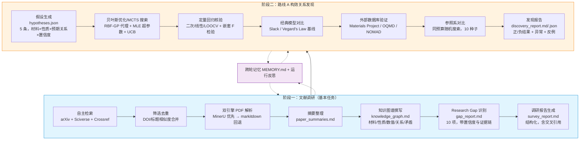
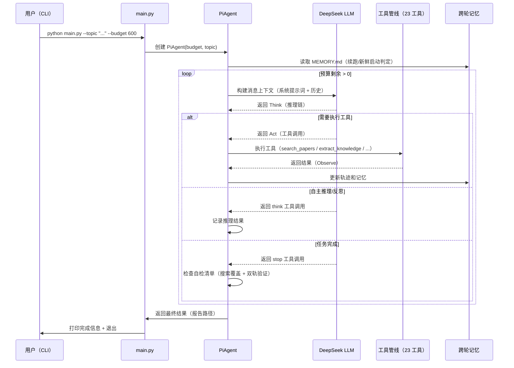
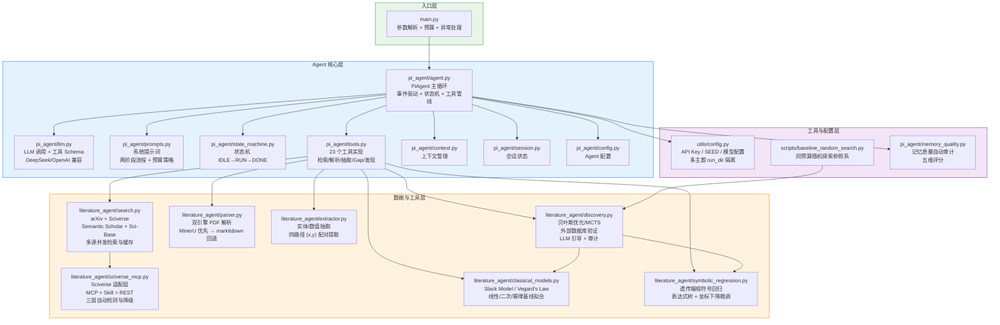
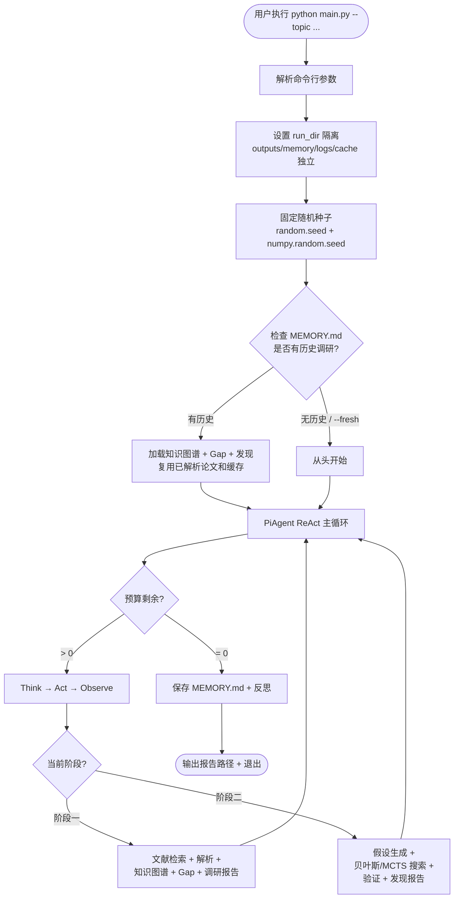
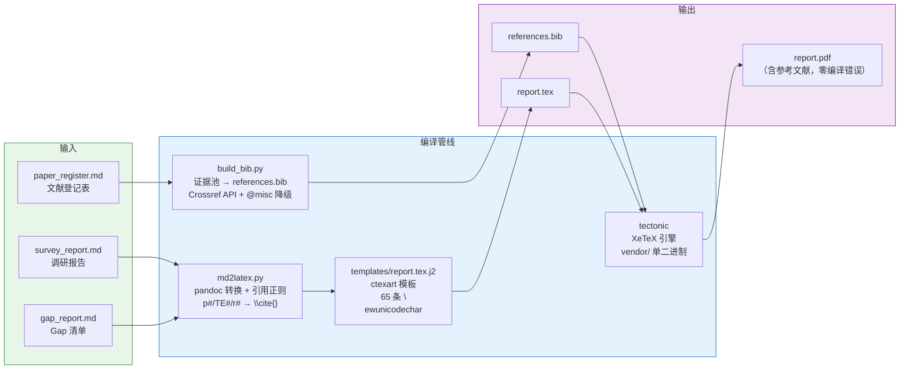
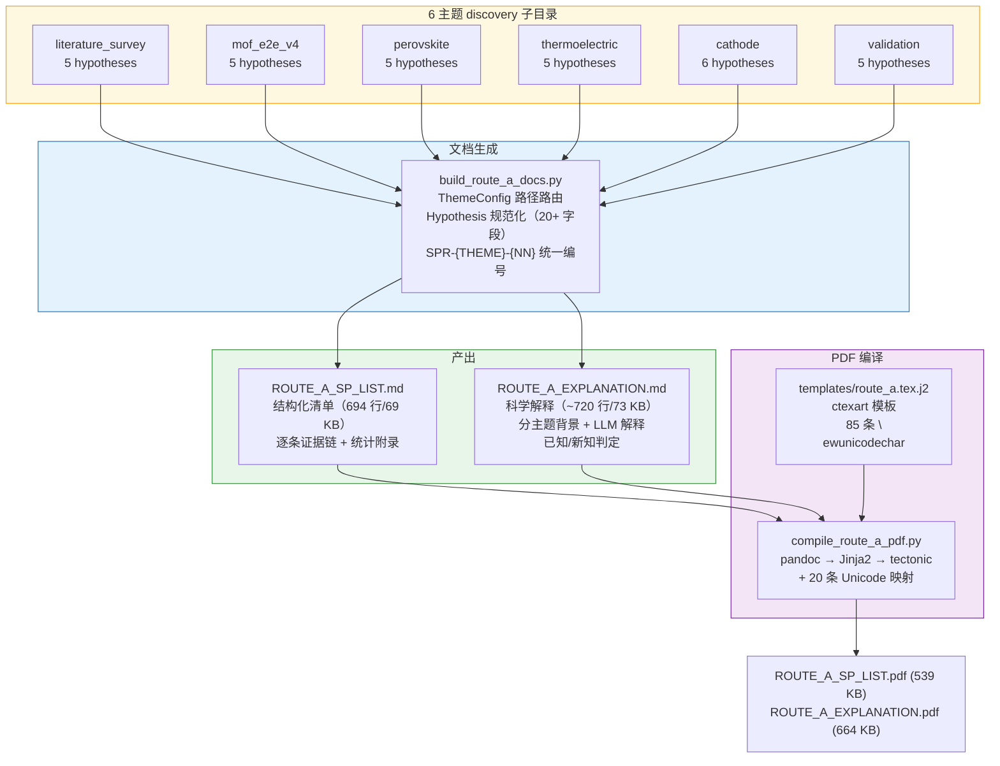

# Pi-Agent 系统说明文档

> **项目名称**：Pi-Agent —— 材料科学文献驱动的构效关系自主发现智能体
> **文档用途**：本文件是 GOAI 赛道三系统说明文档（随源代码仓库提交），覆盖完整系统架构、组件说明、设计决策与运行流程
> **版本**：v2.3.3（初赛终版 + 路线 A + 跨主题 LaTeX 全覆盖）
> **最后更新**：2026-08-12

---

## 1. 项目总体架构



---

## 2. Agent 主循环（ReAct 循环：Think → Act → Observe）



---

## 3. 数据流图

```mermaid
flowchart LR
    subgraph Input["数据输入"]
        D1[arXiv API] --> Search
        D2[Sciverse API<br/>MCP/Skill/REST 三层接入] --> Search
        D3[Crossref] --> Search
    end

    subgraph Processing["处理管道"]
        Search["文献检索<br/>search.py<br/>多源并发 + 去重合并"] --> Parse
        Parse["文档解析<br/>parser.py<br/>MinerU + markitdown<br/>PDF/DOCX/HTML → Markdown"] --> Extract
        Extract["知识抽取<br/>extractor.py<br/>entity/value extraction<br/>+ (x,y) pair extraction"] --> KG
    end

    subgraph Knowledge["知识组织"]
        KG["知识图谱<br/>knowledge_graph.md<br/>R1-R33 构效关系<br/>量化建模数值表"] --> Gap
        Gap["Gap 识别<br/>gap_report.md<br/>10 项 Gap<br/>严重程度 × 置信度 × 证据链"]
    end

    subgraph Discovery["构效关系发现"]
        Gap --> Hypo["假设生成<br/>hypotheses.json<br/>5 条可验证假设"]
        Hypo --> Search2["贝叶斯/MCTS 搜索<br/>discovery.py<br/>RBF-GP + UCB + LLM 引导"]
        Search2 --> Validate["定量验证<br/>quantitative_validation.md<br/>Classical Models 对比<br/>Slack / Vegard / Linear"]
        Validate --> External["外部数据库验证<br/>Materials Project / OQMD"]
        External --> Report
    end

    subgraph Output["输出产物"]
        Report["发现报告<br/>discovery_report.md/.json<br/>正/负/异常/反例四类信号"]
    end

    KG --> Summary["调研报告<br/>survey_report.md"]
    Gap --> Summary

    style Input fill:#e8f5e9,stroke:#388e3c
    style Processing fill:#e3f2fd,stroke:#1976d2
    style Knowledge fill:#fff8e1,stroke:#ffa000
    style Discovery fill:#fce4ec,stroke:#c62828
    style Output fill:#f3e5f5,stroke:#7b1fa2
```



---

## 4. 组件依赖关系图



---

## 5. 各组件简要说明

### 5.1 入口层

| 组件 | 文件 | 说明 |
|------|------|------|
| **主入口** | `main.py` | 命令行参数解析（`--topic` / `--budget` / `--run-dir` / `--fresh` / `--seed`），预算控制，异常处理，启动 PiAgent |

### 5.2 Agent 核心层

| 组件 | 文件 | 说明 |
|------|------|------|
| **PiAgent** | `pi_agent/agent.py` | Agent 主循环，事件驱动架构 + 状态机 + 工具管线调度。负责 ReAct 循环（Think -> Act -> Observe），跨轮记忆管理 |
| **LLM 调用** | `pi_agent/llm.py` | DeepSeek V4 Flash API 调用封装（OpenAI 兼容接口），工具 Schema 定义，支持任意兼容端点替换 |
| **系统提示词** | `pi_agent/prompts.py` | 两阶段流程提示词（文献调研 + 构效关系发现），预算策略（阶段一 <= 35%，阶段二 >= 55%），23 个工具用法说明，ReAct 协议规则 |
| **状态机** | `pi_agent/state_machine.py` | Agent 状态机：IDLE -> RUN -> DONE，处理中断/恢复/错误状态转换 |
| **工具实现** | `pi_agent/tools.py` | 23 个工具实现：`think` / `search_papers` / `parse_paper` / `extract_knowledge` / `analyze_gaps` / `generate_report` / `generate_hypotheses` / `run_discovery_search` / `check_novelty` / `validate_discovery` / `run_model_comparison` / `symbolic_regression` / `cross_theme_connections` / `generate_discovery_report` 等 |
| **上下文管理** | `pi_agent/context.py` | 会话上下文管理，token 预算跟踪，压缩策略 |
| **会话状态** | `pi_agent/session.py` | 会话持久化与恢复，checkpoint 机制 |
| **记忆质量审计** | `pi_agent/memory_quality.py` | 跨轮记忆质量自动审计（五维评分：数值证据/来源/结论/占位/过短），低质量条目标记归档 `memory_quality.md` |

### 5.3 数据与工具层

| 组件 | 文件 | 说明 |
|------|------|------|
| **文献检索** | `literature_agent/search.py` | 多源文献搜索引擎：arXiv API（免费）+ Sciverse REST API + Sci-Base 数据集（可选）。多源并发检索，DOI/标题去重合并，检索审计日志 |
| **Sciverse 适配** | `literature_agent/sciverse_mcp.py` | Sciverse 三层接入适配：MCP（JSON-RPC 2.0 客户端）> Skill（subprocess 调用）> REST API 直连。自动检测与降级，全部不可用时回退纯 arXiv |
| **文档解析** | `literature_agent/parser.py` | 双引擎 PDF/DOCX/HTML 解析：MinerU（Cloud > 本地服务 > pip 包）优先，markitdown 本地引擎兜底。输出统一的 `ParsedDocument` 结构 |
| **知识抽取** | `literature_agent/extractor.py` | 材料/性能/数值实体抽取，四路径 (x,y) 配对提取（Markdown 表格按列 / 句子序列 / 句对 / 笛卡尔兜底），知识图谱数据模型 |
| **构效关系发现** | `literature_agent/discovery.py` | 贝叶斯优化（RBF-GP 代理，超参数 MLE 拟合 + UCB）+ MCTS 搜索。LLM 引导（可配置频率，默认每 5-10 轮），证据打分，外部数据库验证（Materials Project / OQMD），LLM 引导审计事件 |
| **经典模型** | `literature_agent/classical_models.py` | 经典基线拟合：Slack 带隙-温度模型（Varshni-Einstein）、Vegard 定律（线性组分-晶格常数）、二次多项式、幂律模型。含多起点曲线拟合 + 纯 numpy 网格搜索兜底 |
| **符号回归** | `literature_agent/symbolic_regression.py` | 轻量遗传编程符号回归（仅依赖 numpy）：表达式树（+ - * / ^ exp log sqrt sin），ramped half-half 初始化 + 模板播种，锦标赛选择 + 子树交叉 + 多种变异，Lamarckian 坐标下降常量微调 |

### 5.4 Agent 角色分工（八类）与十六步链路

调研任务由工作流引擎拆解为八类角色任务（任务规划、文献检索、文献筛选、PDF 解析与知识抽取、跨文献知识融合、Research Gap 识别、证据核验、报告生成），由事件驱动状态机编排执行，覆盖「科学问题输入 → 报告生成」的十六步完整链路：

| # | 角色任务 | 覆盖链路步骤 |
|---|---------|-------------|
| 1 | 任务规划 | 科学问题输入、任务拆解、检索策略生成 |
| 2 | 文献检索 | 多源检索 |
| 3 | 文献筛选 | 去重与筛选 |
| 4 | PDF 解析与知识抽取 | PDF 全文解析、材料知识抽取、实体规范化与单位统一、结构化知识库 |
| 5 | 跨文献知识融合 | 跨文献融合、冲突与缺失检测 |
| 6 | Research Gap 识别 | Research Gap 生成 |
| 7 | 证据核验 | 证据核验、Gap 评分排序 |
| 8 | 报告生成 | 报告生成、引用与事实检查 |

十六步完整链路：科学问题输入 → 任务拆解 → 检索策略生成 → 多源检索 → 去重与筛选 → PDF 全文解析 → 材料知识抽取 → 实体规范化与单位统一 → 结构化知识库 → 跨文献融合 → 冲突与缺失检测 → Research Gap 生成 → 证据核验 → Gap 评分排序 → 报告生成 → 引用与事实检查。

### 5.5 工具管线全景表（23 个工具）

工具按两阶段管线组织，由 `pi_agent/tools.py` 统一注册并注入 PiAgent 主循环：

| # | 工具名 | 阶段 | 功能 | 对应模块 |
|---|--------|------|------|---------|
| 1 | `think` | 全局 | 自主推理/反思（ReAct 协议的 Think 步骤） | `prompts.py` |
| 2 | `search_papers` | 阶段一 | 多源文献检索（arXiv + Sciverse + Crossref） | `search.py` |
| 3 | `parse_paper` | 阶段一 | PDF/DOCX/HTML 解析（MinerU → markitdown 双引擎） | `parser.py` |
| 4 | `extract_knowledge` | 阶段一 | 实体/数值抽取 + (x,y) 配对提取 | `extractor.py` |
| 5 | `write_section` | 阶段一 | 知识图谱/报告结构章节撰写 | `prompts.py` |
| 6 | `analyze_gaps` | 阶段一 | Research Gap 识别（类型/严重度/置信度/证据链） | `prompts.py` |
| 7 | `generate_report` | 阶段一 | 调研报告生成（六章结构 + 参考文献） | `prompts.py` |
| 8 | `read_paper` | 阶段一 | 读取已解析论文全文（摘要/正文/表格） | `parser.py` |
| 9 | `list_papers` | 阶段一 | 列出已缓存论文索引（DOI/标题/解析状态） | `search.py` |
| 10 | `compare_papers` | 阶段一 | 对比两篇论文的方法/结论差异 | `prompts.py` |
| 11 | `generate_hypotheses` | 阶段二 | 构效关系假设生成（材料×性质×方向×置信度） | `prompts.py` |
| 12 | `run_discovery_search` | 阶段二 | 贝叶斯优化搜索（RBF-GP + MLE + UCB） | `discovery.py` |
| 13 | `run_discovery_search_mcts` | 阶段二 | MCTS 搜索（可配置 LLM 引导频率） | `discovery.py` |
| 14 | `run_discovery_search_hybrid` | 阶段二 | 贝叶斯 + MCTS 混合搜索 | `discovery.py` |
| 15 | `check_novelty` | 阶段二 | 新颖性核验（外部数据库 + LLM 评估） | `discovery.py` |
| 16 | `validate_discovery` | 阶段二 | 定量回归验证（nested F-test/Bootstrap/LOOCV/Cook's D） | `discovery.py` |
| 17 | `run_model_comparison` | 阶段二 | 经典模型对比（Slack/Vegard/线性/二次/幂律） | `classical_models.py` |
| 18 | `symbolic_regression` | 阶段二 | 遗传编程符号回归（表达式树 + 坐标下降微调） | `symbolic_regression.py` |
| 19 | `cross_theme_connections` | 阶段二 | 跨主题连接发现（缺陷工程 MOF→正极等） | `cross_theme.py` |
| 20 | `generate_discovery_report` | 阶段二 | 发现报告生成（正/负/异常/反例四类信号） | `prompts.py` |
| 21 | `update_memory` | 全局 | 写入跨轮记忆 + 质量自审 | `memory_quality.py` |
| 22 | `read_memory` | 全局 | 读取跨轮记忆（含历史结论/证据链） | `agent.py` |
| 23 | `stop` | 全局 | 任务完成信号（自检清单通过后触发） | `agent.py` |

> 工具命名与方案 docx 3.1 节 Agent 角色表一致。22-23 号工具为 v2.1.0 上下文压缩修复后新增。

---

## 6. 关键设计决策

| 设计决策 | 理由 |
|---------|------|
| 不构建 JSON 知识图谱，改由 Agent 撰写 Markdown 图谱 | LLM 从自然语言推理关系比填充结构化模板更可靠，且图谱质量可由领域专家直接阅读核验 |
| 双引擎 PDF 解析（MinerU 优先 + markitdown 回退） | 兼顾解析质量（MinerU 对中文论文/复杂表格/公式更优）与离线可复现（markitdown 本地引擎） |
| Sciverse 三层接入（MCP > Skill > REST） | 满足赛题"鼓励 MCP/Skill 接入"要求，任一模式不可用自动降级，保证可运行 |
| 确定性计算与 LLM 采样分离 | 搜索打分由文献数值确定性计算（固定 seed 可复现），LLM 负责推理与决策（采样随机但结论带证据链可独立核验） |
| 跨轮记忆（MEMORY.md + 运行反思） | 让 Agent 在多次运行间继承结论、积累证据，而非每次从零开始 |
| GP 代理超参数 MLE 拟合 | RBF 核 length_scale/noise 由负对数边际似然最小化自动确定，不同尺度参数空间不因固定核宽而失真 |
| LLM 引导"注入 + 审计"分离 | LLM 搜索引导默认注入，每次引导调用写入审计事件，LLM 参与可审计 |
| 记忆质量自动审计 | 对 MEMORY.md 按小节做五维质量评分，低质量条目标记归档，防止跨轮记忆退化 |
| LaTeX 零依赖编译 | pandoc (3.10.1) + tectonic (0.17.0) 均为单二进制文件，放 `vendor/`，无需安装 TeX Live/MiKTeX 发行版即可编译 PDF |
| 路线 A 统一 SPR 编号 | 6 主题 31 条假设采用 `SPR-{THEME}-{NN}` 统一命名，主题间可互引用，避免散落 topic 导致引用混乱 |
| 跨主题模板复用 | report.tex.j2 与 route_a.tex.j2 共享同一模式（Jinja2 模板 + pandoc 转换 + 引用正则），降低新文档类型的维护成本 |

---

## 7. 运行流程



---

## 8. LaTeX 报告编译管线

将 Agent 产出的 Markdown 报告（`survey_report.md` + `gap_report.md`）编译为正式 PDF，支持 6 主题一键批量编译。



| 组件 | 文件 | 功能 |
|------|------|------|
| **文献 BibTeX 生成** | `scripts/build_bib.py` | 从 `paper_register.md` + `paper_summaries.md` 提取论文元数据，调 Crossref API 拉标准 BibTeX（51/71 条），无 DOI 的降级 @misc 占位（20/71 条，零虚构） |
| **Markdown → LaTeX** | `scripts/md2latex.py` | pandoc 结构转换 + Python 后处理：`p#`/`r#`/`TE#` 引用转 `\cite{}`、表格 YAML 歧义修复（`---`→`***`）、`\label` 保护（避免 `\cite` 进入 `\csname`） |
| **LaTeX 模板** | `scripts/templates/report.tex.j2` | ctexart 中文文档类，65 条 `\newunicodechar` 映射（希腊字母、上下标、特殊符号、圈号数字、状态图标），Jinja2 变量注入 |
| **PDF 编译** | `vendor/tectonic/tectonic.exe` | XeTeX 引擎单二进制（0.17.0），无需 TeX 发行版；`scripts/compile_report.bat` 一键执行完整链路 |
| **跨主题支持** | `--theme` 参数 | 同一脚本覆盖 6 主题（literature_survey / mof_e2e_v4 / perovskite / thermoelectric / cathode / validation），产出 6 个 PDF 全部零编译错误、零 Unicode 缺字 |

---

## 9. 路线 A 构效关系文档管线

从 6 主题的散落 discovery JSON/MD 文件中提取 31 条假设，生成统一的路线 A 提交文档。



| 组件 | 文件 | 功能 |
|------|------|------|
| **数据提取** | `scripts/build_route_a_docs.py` | 6 主题路径路由（base vs sub 目录），兼容 3 种 JSON 结构，`Hypothesis` dataclass 20+ 规范化字段 |
| **SP 清单生成** | `generate_sp_list()` | 总览表（31 行）+ 逐条详表（材料/性质/方向/置信度/新颖度/搜索方式/证据链/验证状态）+ 统计附录 |
| **解释文档生成** | `generate_explanation()` | 分章节（6 主题 × 学科背景 + 逐假设解释），`_fmt_materials()` 清理 Python repr，`format_evidence_list()` 过滤非论文条目 |
| **LaTeX 编译** | `scripts/compile_route_a_pdf.py` | pandoc → cleanup（空 hypertarget、标题页）→ Jinja2 模板 → tectonic；两文档零编译错误 |
| **SPR 编号体系** | `SPR-{THEME}-{NN}` | 统一命名：SPR-MOF-01~05 / SPR-PVSK-01~05 / SPR-TE-01~05 / SPR-CATH-01~06 / SPR-VAL-01~05 / SPR-MOF-E2E-01~05 |

---

## 10. 仓库目录结构总览

```
pi-agent/                              # 项目根目录
├── main.py                            # 入口：参数解析 + 预算 + 异常处理
├── demo.py                            # 离线自测（不依赖 LLM API）
├── requirements.txt                   # Python 依赖
├── README.md                          # 项目概览 + 快速开始 + 版本记录
│
├── pi_agent/                          # Agent 核心层
│   ├── agent.py                       #   PiAgent 主循环（事件驱动 + 状态机 + 工具管线）
│   ├── llm.py                         #   LLM 调用 + 工具 schema（DeepSeek/OpenAI 兼容）
│   ├── prompts.py                     #   系统提示词（两阶段流程 + 预算策略）
│   ├── tools.py                       #   23 个工具实现工厂
│   ├── _tools_impl.py                 #   工具实现细节
│   ├── state_machine.py               #   状态机（IDLE→RUN→DONE）
│   ├── context.py                     #   上下文管理 + Token 预算
│   ├── session.py                     #   会话持久化 + checkpoint
│   ├── events.py                      #   事件系统
│   ├── memory_quality.py              #   记忆质量自动审计（五维评分）
│   └── config.py                      #   Agent 级配置
│
├── literature_agent/                  # 数据与工具层
│   ├── search.py                      #   多源文献检索（arXiv + Sciverse + Sci-Base）
│   ├── sciverse_mcp.py                #   Sciverse 三层接入（MCP > Skill > REST）
│   ├── parser.py                      #   双引擎 PDF 解析（MinerU → markitdown）
│   ├── extractor.py                   #   实体/数值抽取（四路径 (x,y) 配对）
│   ├── discovery.py                   #   贝叶斯优化 + MCTS + 外部数据库验证
│   ├── scoring.py                     #   证据打分（LLM 引导 + 审计）
│   ├── classical_models.py            #   Slack / Vegard / 线性 / 二次 / 幂律基线
│   ├── symbolic_regression.py         #   遗传编程符号回归
│   ├── bayesian_regression.py         #   贝叶斯回归（Bootstrap CI/LOOCV/Cook's D）
│   ├── regression_diagnostics.py      #   回归诊断
│   ├── cross_theme.py                 #   跨主题连接发现
│   ├── evidence_chain_report.py       #   证据链报告生成
│   └── planned_capabilities.py        #   复赛计划接口占位
│
├── utils/                             # 工具与配置层
│   ├── config.py                      #   全局配置（API Key/SEED/模型/run_dir 隔离）
│   ├── budget_tracker.py              #   时间预算跟踪
│   └── resource_registry.py           #   外部资源注册表（12 项）
│
├── scripts/                           # 编译与辅助脚本
│   ├── build_bib.py                   #   证据池 → references.bib（Crossref API）
│   ├── md2latex.py                    #   Markdown → LaTeX 转换
│   ├── compile_report.bat             #   一键 LaTeX 编译
│   ├── build_route_a_docs.py          #   路线 A 文档生成（31 条假设）
│   ├── compile_route_a_pdf.py         #   路线 A PDF 编译
│   ├── baseline_random_search.py      #   随机探索参照系（v2 打分）
│   ├── run_e2e_rerun.py               #   e2e 全量重跑管线
│   ├── run_validation_pipeline.py     #   验证管线
│   ├── meta_analysis.py               #   元分析
│   ├── prepare_scibase.py             #   Sci-Base 数据集准备
│   └── templates/                     #   LaTeX 模板
│       ├── report.tex.j2              #     调研报告模板（65 条 Unicode 映射）
│       └── route_a.tex.j2             #     路线 A 模板（85 条 Unicode 映射）
│
├── tests/                             # 单元测试（125 项，pytest）
├── docs/                              # 项目文档
│   ├── ARCHITECTURE.md                #   系统说明文档（本文件）
│   ├── COMPLIANCE.md                  #   合规披露
│   ├── REPRODUCIBILITY.md             #   可复现性说明
│   ├── CROSS_THEME_REPORT.md          #   跨主题泛化性验证报告
│   ├── RERUN_GUIDE.md                 #   重跑指南
│   └── E2E_RERUN_GUIDE.md             #   e2e 重跑指南
│
├── workspace/                         # 运行产物
│   ├── outputs/                       #   各主题产出
│   │   ├── <run-dir>/literature_survey/  # 调研报告 + 知识图谱 + Gap 报告 + discovery
│   │   ├── <run-dir>/literature_survey/latex/  # LaTeX 源码 + PDF
│   │   ├── ROUTE_A_SP_LIST.md/.tex/.pdf      # 路线 A 构效关系清单
│   │   └── ROUTE_A_EXPLANATION.md/.tex/.pdf  # 路线 A 科学解释
│   ├── memory/<run-dir>/              #   跨轮记忆
│   ├── logs/<run-dir>/                #   运行轨迹 + 审计日志
│   └── data/literature_cache/         #   文献缓存（search_log.jsonl 入库）
│
└── vendor/                            # 外部二进制（pandoc + tectonic，不入库）
    ├── pandoc/pandoc-3.10.1/
    └── tectonic/
```

---

*本文档基于项目源代码与初赛提交材料撰写，所有图表使用 Mermaid 格式，在 GitHub 上可直接渲染。*
